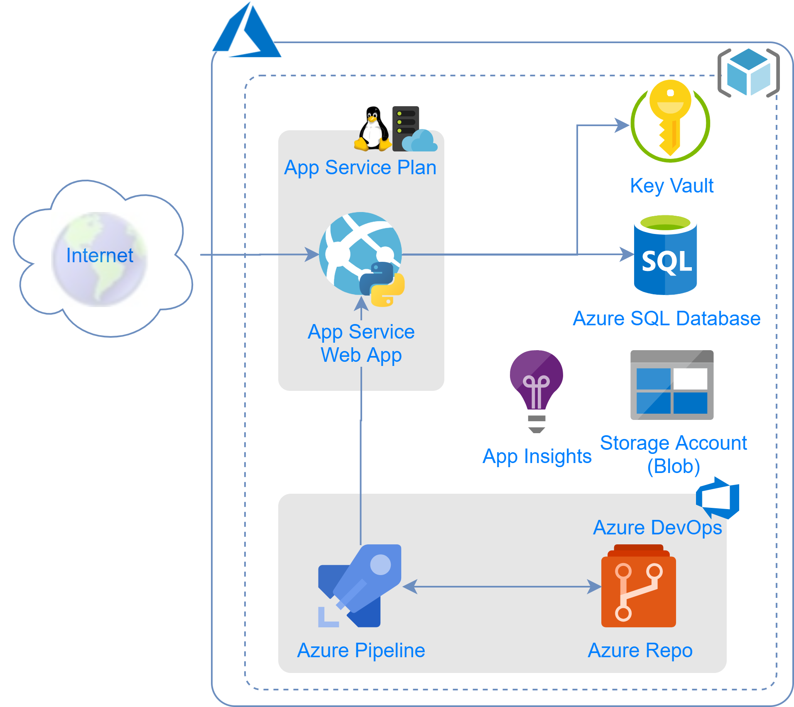

# Python API with Azure App Service and FastApi in 10 minutes

You can download the slides from [here](azure-python-api-app-service-in-10-minutes.pptx).

## Architecture Overview





* **Resource group:** A resource group is a logical container for Azure resources.
* **App Service Web App:** Azure App Service is a fully managed platform for creating and deploying cloud applications. API is running on Python with virtually any framework - Flask, Django, FastApi etc.
* **App Service Plan:** provides the managed virtual machines that host the API application. All apps associated with a plan run on the same virtual machine instances. 
  * Linux App Service Plan supports Python.
  * Manages application scalability.
* **Key Vault:** For storing application secrets.
* **SQL Database:** Fully managed database service. Provides application data persistence.
* **Storage Account:** Stores application logs as blobs.
* **Azure DevOps:** A fully managed service providing development and collaboration tools. 
* **Azure Repo:** Source code management repository.
* **Azure Pipelines:** A cloud service for automatically build, test and deploy code project.  


## Step 1. Create Azure Repo

Repository Name: [CONS_PoC_FastApi](https://dev.azure.com/cbsp-abnamro/GRD0001030/_git/CONS_PoC_FastApi?path=%2F&version=GBmaster)

## Step 2. Create your application

See [FastApi First Steps](https://fastapi.tiangolo.com/tutorial/first-steps/)

### Checkout repository

```bash
$ git clone https://dev.azure.com/cbsp-abnamro/GRD0001030/_git/CONS_PoC_FastApi
$ cd CONS_PoC_FastApi
```

### Create Python virtual environment

```bash
$ py -3.7 venv -m .venv
$ source .venv/Scripts/activate
```

### Install Python dependencies

Create a file `requirements.txt`

```python
fastapi
uvicorn
```

Install python packages:

```bash
$ pip install -r requirements.txt
```

### Create application code

Create a file `application.py`

```python
from fastapi import FastAPI

app = FastAPI()

@app.get("/")
async def root():
    return {"message": "Hello World"}
```

### Run and test the applicaiton

Test your application:

```bash
$ uvicorn application:app --reload
```

Open the browser: http://localhost:8000

### Commit and push changes to repo

```bash
git add .
git commit -m "initial version"
git push
```


## Step 3. Create Administration Azure Pipeline

We are going to create following resources:

| Resource Type       | Resource Name                                |
| ------------------- | -------------------------------------------- |
| Storage Account     | `$(ServiceShortName)$(EnvironmentCode)01sa`  |
| Application Insight | `$(ServiceShortName)-$(EnvironmentCode)-ai`  |
| App Service         | `$(ServiceShortName)$(EnvironmentCode)01`    |
| App Service Plan    | `$(ServiceShortName)-$(EnvironmentCode)-asp` |

### Define Variables

| Variable Name         | Value                |
| --------------------- | -------------------- |
| EnvironmentCode       | d                    |
| ResourceGroupName     | metadatacatalog-d-rg |
| ServiceConnectionName | metadatacatalog-d-rg |
| ServiceShortName      | fademo               |

### Create Job `Development`

The job is responsible for creation and configuration of resources:

* Create storage account
* Create App Insight
* Create App Service

The App Service task will create or update automatically the App Service Plan.

### Create storage account

Name should be 

`$(ServiceShortName)$(EnvironmentCode)01sa` 

### Create App Insight

Name should be:

`$(ServiceShortName)-$(EnvironmentCode)-ai`

### Create App Service

Name should be

`$(ServiceShortName)$(EnvironmentCode)01`

Specify application settings:

```
SCM_DO_BUILD_DURING_DEPLOYMENT:true
```

Specify application service plan name:

`$(ServiceShortName)-$(EnvironmentCode)-asp`

### Run the pipeline

Once the pipeline finishes, observe the changes in the resource group.


## Step 4. Create Release Azure Pipeline

### Define Variables

| Variable Name         | Value                |
| --------------------- | -------------------- |
| AppBuildDir           | ApiBuild             |
| EnvironmentCode       | d                    |
| ResourceGroupName     | metadatacatalog-d-rg |
| ServiceConnectionName | metadatacatalog-d-rg |
| ServiceShortName      | fademo               |

### Specify Source Artifact

### Create Job `Development`

### Add `Copy Files` task


### Add `Archive files` task

### Add `Azure App Service Deploy` task

Make sure you specified:

* Deployment method: Zip deploy

* App settings:

  ```
  -SCM_DO_BUILD_DURING_DEPLOYMENT true
  ```

* Configuration settings:

  ```
  -appCommandLine "python -m uvicorn application:app --host 0.0.0.0 --port 8000"
  ```

  

## References

* [Azure Resources Naming Conventions](https://dev.azure.com/cbsp-abnamro/Azure/_wiki/wikis/Azure.wiki/199/Azure-Resource-Naming-Conventions?anchor=service-principals)
* [Configure a Linux Python app for Azure App Service](https://docs.microsoft.com/en-us/azure/app-service/containers/how-to-configure-python)
* [Basic Web App Architecture](https://docs.microsoft.com/en-us/azure/architecture/reference-architectures/app-service-web-app/basic-web-app)

