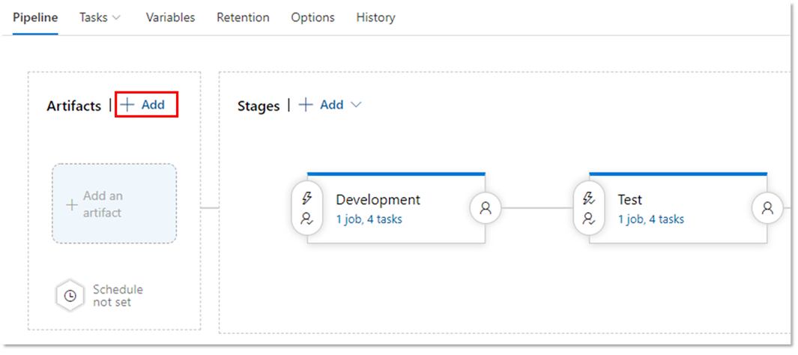
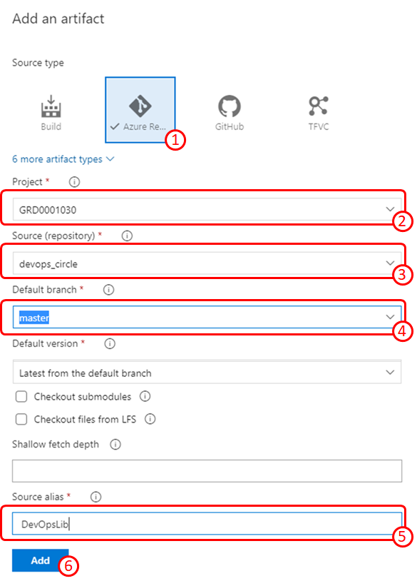
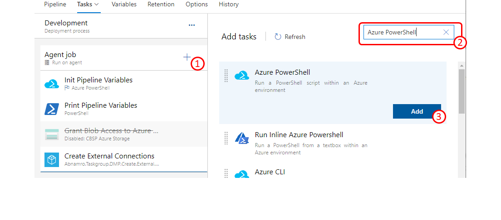
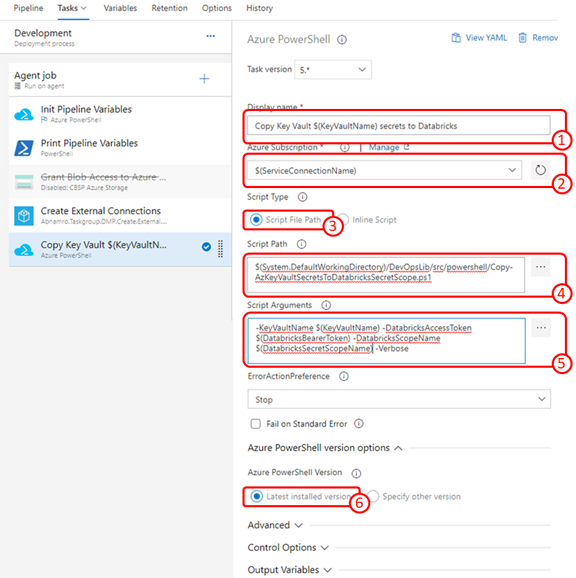

# Copy secrets from Azure Key Vault to Databricks Secret Scope

[[_TOC_]]

## Problem
You need to make secrets from Azure Key Vault available into Databricks. The solution should be automated so that same step can be repeated on multiple environments, eliminating human intervention and human error.

The best solution would be to use [Key Vault baked secret scope](https://docs.microsoft.com/en-us/azure/databricks/security/secrets/secret-scopes#azure-key-vault-backed-scopes) in Databricks. Unfortunately creation of Key Vault baked secret scope is in public preview and is only available from the UI and cannot be automated.

## Solution
Use the [Copy-AzKeyVaultSecretsToDatabricksSecretScope.ps1](https://dev.azure.com/cbsp-abnamro/GRD0001030/_git/devops_circle?path=%2Fsrc%2Fpowershell%2FCopy-AzKeyVaultSecretsToDatabricksSecretScope.ps1) PowerShell script.

The script can be used from the command line or can be embedded into automated pipeline.

### Azure Release DevOps Pipeline

You can use this solution in your platform automation pipeline. In this example, we use Azure DevOps Release pipeline. You can easily replicate the solution in a CI pipeline (YAML) or another automation tool.

#### Prerequisites

1. You have following pipeline variables defined:
   - `ServiceConnectionName` - Azure DevOps service connection used to authenticate the pipeline
   - `KeyVaultName` - Azure Key Vault name from which we are taking the secrets.
   - `DatabricksBearerToken` - Databricks Bearer Token
   - `DatabricksSecretScopeName` - Name of the target Databricks secret scope where the secrets will be copied. 

#### Step 1: Link script repository to the pipeline
To be able to execute the PowerShell script from your pipeline, you need to include the sources repository as an artifact to the pipeline.

Click the Add link. This will bring the Add an artifact form.

In Add an artifact form:
1. Select `Azure Repos Git` as `Source type`
2. Specify `Project`
3. Specify `Source (repository)`
4. Select `Default branch`
5. Specify `Source alias` to be `DevOpsLib`. We are going to use this later.
6. Click the `Add` button

The DevOpsLib repository shows as an artifact for the pipeline.

#### Step 2: Add Azure PowerShell task to the stage

Add Azure PowerShell task:
1. Inside your pipeline stage click the + button to add a task.
2. In the search box enter `Azure PowerShell`
3. From the list of tasks select `Azure PowerShell` and click the `Add` button

Modify the Azure PowerShell task properties as follows:
1. Specify `Display name` as `Copy Key Vault $(KeyVaultName) secrets to Databricks`
2. Specify `Azure Subscription` as `$(ServiceConnectionName)`
3. Select `Script Type` to be `Script File Path`
4. Specify the `Script Path` as `$(System.DefaultWorkingDirectory)/DevOpsLib/src/powershell/Copy-AzKeyVaultSecretsToDatabricksSecretScope.ps1`
5. Specify the `Script Arguments` as `-KeyVaultName $(KeyVaultName) -DatabricksAccessToken $(DatabricksBearerToken) -DatabricksScopeName $(DatabricksSecretScopeName) -Verbose`
6. Select `Azure PowerShell Version` to be `Latest installed version`

As you can see the task configuration, uses pipeline variables. So make sure you have defined these variables as described in the Prerequisites.

Your pipeline is ready. Now you can save it and start using it.

## Discussion

The PowerShell script used in this solution makes direct REST API calls to the Databricks API to manage the secrets.

If you perform a key rotation, you might want to include the secret copy step in your key rotation pipeline.

The code in the devops_cirlce repository is provided 'as-is'. In the future it can also change in unpredictable way. It might be a good idea for you to fork the code into your own repository.

