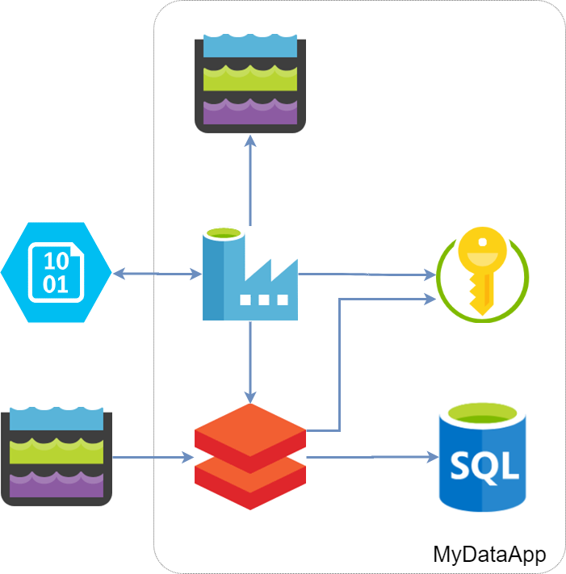

# Substitute Parameters in Files

`substitute_file_params` is a command line interface (CLI), which allows parameters to be substituted in multiple files. Substitution is in-place.

The CLI can be used for example in release pipelines to achieve environment awareness. It can also be used in interactive mode.

To use the CLI, you need to create a configuration file. Configuration file is used to define settings and substitute rules.

Two type of substitute rule definitions are supported - simple and verbose. Check the config file reference for more details.

## Sample Scenario

In our scenario we have fictitious data processing application, named `MyDataApp`, implemented in Azure.



In our scenario:

1. External application delivers data into a landing zone - ADLS Gen 2 storage. 
2. When data is delivered, the external application creates a message blob. 
3. Data Factory is triggered by the creation of the message blob.
4. Data Factory runs data processing pipeline in Databricks.
5. Databricks processes the data described in the message blob and updates a SQL Database
6. Once data processing is complete, Data Factory archives the message blob into ADLS Gen2 storage.

We use Key Vault for secrets:

* Data Factory needs Databricks token
* Databricks needs credentials for accessing the SQL database.
  Accessing landing zone, uses Databricks credentials forward.

Data Factory artifacts are stored as JSON files in git (Azure repo).

Databricks notebooks are stored as python files in git (Azure repo).

We will demonstrate how to substitute parameters in Data Factory artifact files. This step is used during release process.

### Substitution Configuration File

`substitute-datafactory.config`

```properties
[config]
file-pattern=**/*.json

[DEFAULT]
EnvCode=${ENV:EnvCode}

[substitute]
mydataapp-d-01-df=mydataapp-${EnvCode}-01-df
mydataapp-d-01-kv=mydataapp-${EnvCode}-01-kv
mydataapp-d-01-dbr=mydataapp-${EnvCode}-01-dbr
mydataappd01sa=mydataapp${EnvCode}01df
mydataappd01sqldb=mydataapp${EnvCode}01sqldb
```

### Perform Substitution

To invoke the parameter substitution utility, following command line could be used:

```bash
python devopslib/scripts/substitute_file_params.py \
    -d /src/etl/datafactory  \
    -v 4  \
    /etc/substitute-datafactory.config
```

* During replace current working directory is `/src/etl/datafactory`
* Verbosity is set to maximum. This is a very useful option for debugging, but keep in mind that it might reveal secrets in the log files.
*  To perform substitution, use the configuration stored in `/etc/substitute-datafactory.config` 

### Substitute Result

Here is the source for the Data Factory linked service for the application Key Vault from the build - before substitution:

```json
{
	"name": "AzureKeyVault_DSAA",
	"type": "Microsoft.DataFactory/factories/linkedservices",
	"properties": {
		"annotations": [],
		"type": "MyDataApp-KeyVault-ls",
		"typeProperties": {
			"baseUrl": "https://mydataapp-d-01-kv.vault.azure.net/"
		}
	}
}
```

After the substitution utility is executed (environment variable `EnvCode=t`) the name of the key vault is updated:

```json
{
	"name": "AzureKeyVault_DSAA",
	"type": "Microsoft.DataFactory/factories/linkedservices",
	"properties": {
		"annotations": [],
		"type": "MyDataApp-KeyVault-ls",
		"typeProperties": {
			"baseUrl": "https://mydataapp-t-01-kv.vault.azure.net/"
		}
	}
}
```

Utility will traverse all sub-directories and execute all substitution rule defined in the substitution configuration file.

## Command Line Reference

```
Usage: substitute_file_params.py [OPTIONS] CONFIG_FILENAME

Options:
  -f, --file-pattern TEXT         Substitute file pattern. Default is '*'
                                  (all).
  -d, --work-directory TEXT       Working directory. Default is current
                                  directory.
  -e, --environment-variables TEXT
                                  List of environment variables to pass for
                                  substitute. Default is '*'
  -m, --substitute-method TEXT    Substitute method: PLAINTEXT or TEMPLATE.
                                  Default is PLAINTEXT
  -v, --verbosity TEXT            Verbosity level v-vvvv or 1-4. E.g. 'v',
                                  'vv', '1', '4'
  -r, --remove-config             Flag to remove config file after substitute.
  --help                          Show this message and exit.
```


File search pattern uses Linux glob syntax. Multiple patterns can be specified, using separator: ,:;

Environment variable names are case insensitive. Multiple environment variable names could be specified, separating names by ,:;

Verbosity level could be controlled by specifying multiple 'v' or an integer number.

Before searching for files, change to the specified work directory.

## Reference for Substitute Config File

Here is a sample config file, illustrating most of the features:

```properties
[config]
# Config section is used to specify the behavior of the replacement.
# config section is optional

# You can override default prefixes for the verbose substitution rule definition.
# Default search string prefix is __search__.
prefix-search=search.
# Default replacement string prefix is __replace__.
prefix-replace=replace.

# File pattern uses Linux glob syntax. You can specify multiple patterns, separating them by ,;:
# Substitute in all JSON and html files in all subdirectories
file-pattern=**/*.json,**/*.html

# Valid substitute methods: PLAINTEXT, TEMPLATE
substitute-method=PLAINTEXT

# Which environment variables to expose
# By default all (*) environment variables are exposed.
# Environment variable can be refered using the: ${ENV:<variable-name>} syntax
# - Multiple variables can be specified, using list separators: ,:;
# - Case insensitive search in environment
# - Leading and trailing spaces are ignored
environment-variables=EnvCode

[DEFAULT]
# DEFAULT section is used to define settings (like variables) which can be re-used in other sections.
# DEFAULT section is optional.

# Define EnvCode 'variable', initialized from EnvCode environment variable
EnvCode=${ENV:EnvCode}

[substitute]
# substitute section is used to specify replacement rules.
# substitute section is mandatory

# Define replacement using simple replacement rule:
# Syntax: <search-string>=<replace-string>
myapp-d-rg=myapp-${EnvCode}-rg

# Define replacement using verbouse replace rule.
# Verbose rule is defined on multiple lines and uses rule name.
# 1. Define search string for ResourceGroup rule:
# <prefix-search><rule-name>=<search-string>
search.ResourceGroup=myapp-d-rg

# 2. Define replacement string for the ResourceGroup rule:
# <prefix-replace><rule-name>=<replace-string>
replace.ResourceGroup=myapp-${EnvCode}-rg
```

Configuration settings have default values, which can be overridden in the configuration file `config` section. Settings, specified in the config file take precedence over the default setting values.

Settings, specified from the command line override the settings, specified in the config file.

## Links

* Substitute utility repository: https://dev.azure.com/cbsp-abnamro/GRD0001030/_git/CONS_DevOps?path=%2Fdevopslib%2Fscripts