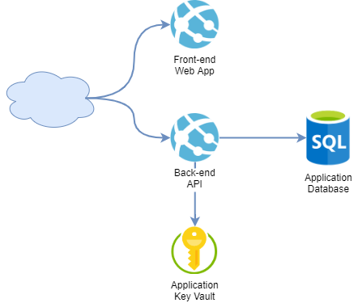
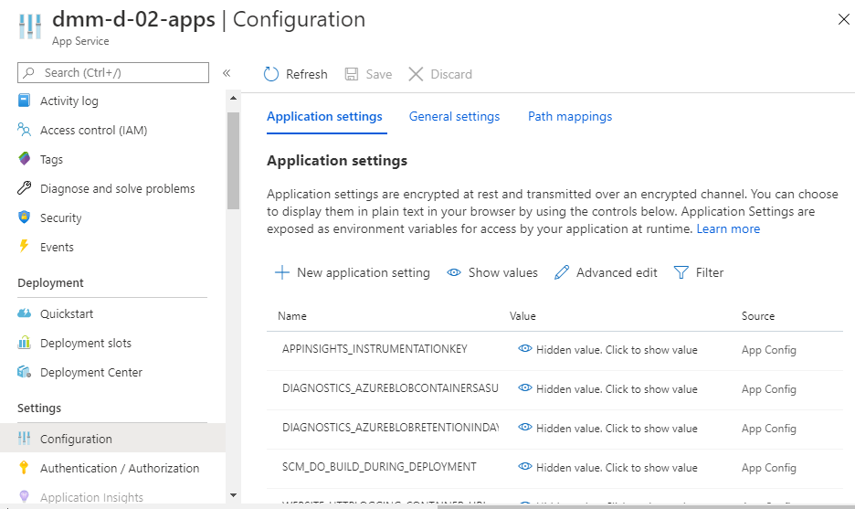
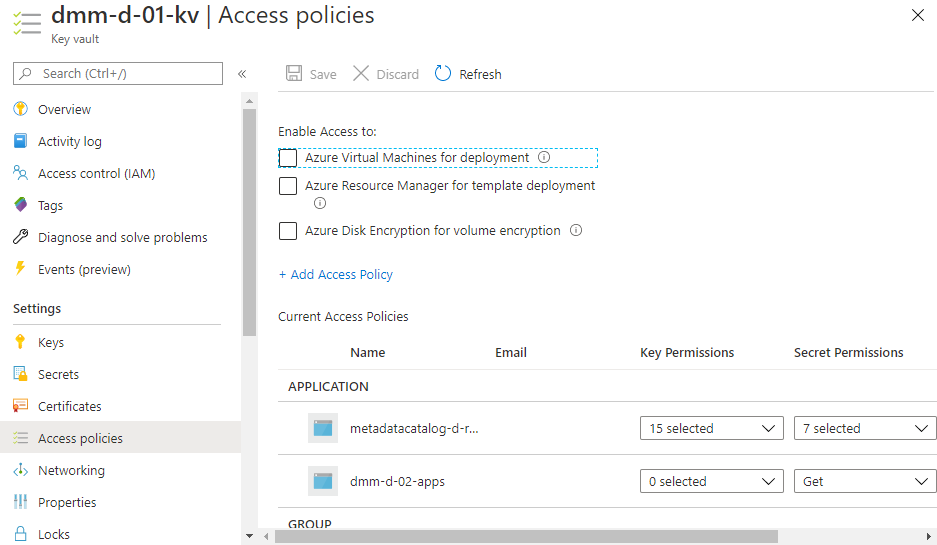
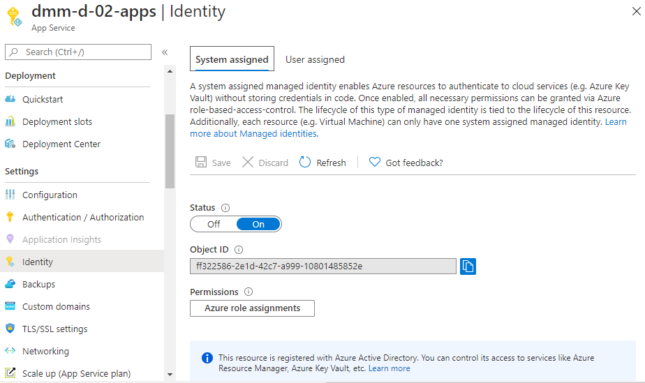

# Configure Python Web App Running on Azure App Service

## Problem

You are building a Python based Azure Web App and you need to make your Web App environment-aware, while maintain it secure:

* Define environment specific settings
* Retrieve secrets, e.g. passwords in a secure way

Let's assume a typical Web App, running on Azure:



* **Front-end Web App** provides HTML-based UI. Usually this is a static content, Single Page Application, implemented using Vue.js, Angular, React, etc. It could be hosted in Azure App Service, CDN, Blob, etc.
* **Back-end API** provides the application business tier functionality. It could be accessed by Front-end Web App, Native Mobile apps, etc. It is hosted in Azure App Service and is subject to our discussion.
* **Application Key Vault** stores application secrets, e.g. database password.
* **Application Database** provides persistency to the application. To authenticate to the Application Database, the application needs the technical user credentials, stored in the Application Key Vault. 

Our application needs following environment specific settings:

* KEY_VAULT_NAME - The name of the Application Key Vault
* DB_NAME - The name of the Azure Sql Database
* DB_SERVER_NAME - The name of the Azure Sql Server, hosting the Azure Sql Database
* DB_USERNAME - The name of the technical database user
* DB_PASSWORD - The password of the technical database user

## Solution

To make your environment environment aware, you can use multiple approaches. Here are two most popular:

* Define Application Settings to Azure App Service

  This is the preferred approach to make the application environment aware. To reduce the number of configuration settings being passed, you can derive settings, based on naming conventions, although passing all environment specific settings from the release pipeline is also valid approach.

* Perform parameter substitution during release deployment

  This approach requires additional code to perform the substitution. We will not discuss it here and the need for it was not identified in the context of Web App.

To store secrets we use Azure Key Vault. To access secrets, stored in Key Vault we could use, for example:

* Application Settings reference to Key Vault Secret

  With this approach the application reads the settings from the environment variables. The app service retrieves the secrets from the Key Vault under the hood in a way transparent for the application. One issue with this approach is that the secret reference includes the secret version. This means that when the secret is updated, the Web App Key Vault reference also needs to be updated.

  Although the preferred method is to access secrets with Python packages, I will give an example on using Application Settings with reference to Key Vault secret.

* Access Key Vault secrets with Python packages

  With this approach the application needs to be able to access the Key Vault. Fortunately Microsoft provides convenient packages for identity and Key Vault access.


### Define Application Settings

You can find Application Settings in Azure Portal, under the App Service blade, Configuration section:



These settings are available for the application, running in the App Service as environment variables. For example:

```python
import os
ENV_CODE = os.environ.get('DMM_ENV_CODE', 'd')

print(ENV_CODE)
```

With this approach you could also specify default values, appropriate for local development. Specifying default values which might vary across environments might be a source of difficult to catch errors. So be aware.

### Access Key Vault Secrets from Application

To access Key Vault you need to define access policy which allows your application to perform get operation on secrets. Your application needs to authenticate:

* Create dedicated service principal
* Use system assigned Managed Identity
* Use developer's credentials

Key Vault access policies could be found in Azure Portal under the Key Vault blade, access policies section:

 


You can find the App Service managed identity under the App Service blade, Identity section:



### Access Key Vault Secrets with Python Packages

Microsoft provides Python packages you can use to access Azure Key Vault secrets, keys and certificates: `azure-keyvault-secrets` and `azure-identity`.

To install these packages, use:

```bash
pip install azure-keyvault-secrets azure-identity
```

Do not forget to add them to your `requirements.txt` file.

Here is an example of retrieving database password from Key Vault:

```python
from azure.identity import DefaultAzureCredential
from azure.keyvault.secrets import SecretClient

DB_USERNAME = 'dcatd01sqldb-reader'
KEYVAULT_URL = 'https://dmm-d-01-kv.vault.azure.net'

az_credential = DefaultAzureCredential()
secret_client = SecretClient(KEYVAULT_URL, az_credential)

DB_PASSWORD = secret_client.get_secret(DB_USERNAME).value

print(DB_PASSWORD)
```


## End-to-End Example

Here I am gonna give you an example of flexible, yet easy to use approach to application configuration.

### App Service Administration

In our example the administration highlights are:

* Enable system assigned Managed Identity for the App Service
* Assign Key Vault access policy for the Managed Identity to get secrets
* Define `ENV_CODE` App Service application setting

You can apply the administration changes manually, but I will show you how to do this programmatically so that it can be done from a CI/CD pipeline.

#### Enable System Assigned Managed Identity

You can create identity for the application, using PowerShell:

```powershell
Set-AzWebApp -AssignIdentity $true -Name $WebAppName -ResourceGroupName $ResourceGroupName
```

#### Assign Key Vault access policy for the Managed Identity

Steps to set access policy for the managed identity to Key Vault:

1. Find the managed identity ObjectId

   One possible way is to find the Azure Resource and access the `Identity` property.

2. Execute `Set-AzKeyVaultAccessPolicy` cmdlet.

To achieve the same, using PowerShell:

```powershell
# Get the Managed Identity Object ID
$PrincipalId = (Get-AzResource -Name $WebAppName -ResourceGroupName $ResourceGroupName).Identity.PrincipalId

# Set Azure Key Vault policy for the Managed Identity
Set-AzKeyVaultAccessPolicy -VaultName $KeyVaultName -ObjectId $PrincipalId -PermissionsToSecrets Get -PassThru
```


#### Define App Service Application Settings

In this example I use PowerShell and Azure CLI to update the App Service application settings

```powershell
$work_dir = './work'

mkdir $work_dir -Force

@{
   "ENV_CODE" = '$EnvCode'
} | ConvertTo-Json > $work_dir/appsettings.json

az webapp config appsettings set -g $ResourceGroupName -n $WebAppName --settings @$work_dir/appsettings.json
```

#### Define App Setting Reference to Key Vault

```powershell
$work_dir = "./work"

$ResourceGroupName = "dmm-${EnvCode}-rg"
$KeyVaultName = "dmm-${EnvCode}-01-kv"
$WebAppName = "dmm-${EnvCode}-01-apps"
$DbUserName = "dmm${EnvCode}01sqldb-operator"
$DbPasswordSecret = (Get-AzKeyVaultSecret -VaultName $KeyVaultName -Name $DbUserName)

$Settings = @{
   'ENV_CODE' = $EnvCode,
   'DB_USERNAME' = $DbUserName,
   'DB_PASSWORD' = "@Microsoft.KeyVault(SecretUri=$(DbPasswordSecret.Id))"
}

mkdir $work_dir -Force
$Settings | ConvertTo-Json > $work_dir/appsettings.json

az webapp config appsettings set -g $ResourceGroupName -n $WebAppName --settings @$work_dir/appsettings.json
```


### Define Python Application Settings

It is a good practice to use value objects (data classes) for application settings or properties. Here is an example that covers all the required application settings in our scenario.

Create an `appsettings.py` module, e.g.:

```python
import os
from dataclasses import dataclass
from azure.identity import DefaultAzureCredential
from azure.keyvault.secrets import SecretClient
from azure.core.exceptions import ResourceNotFoundError

@dataclass
class AppSettings:
    ENV_CODE:str = None
    KEY_VAULT_NAME:str = None
    DB_NAME:str = None
    DB_SERVER_NAME:str = None
    DB_SERVER_HOST: str = None
    DB_USERNAME:str = None
    DB_PASSWORD:str = None
    
    _secret_client: SecretClient = None

    def __post_init__(self):
        self.ENV_CODE = self.resolve(
                        env='ENV_CODE',
                        default='d')
        self.KEY_VAULT_NAME = self.resolve(
                        env='KEY_VAULT_NAME',
                        default=f'dmm-{self.ENV_CODE}-01-kv')
        self.DB_NAME = self.resolve(
                        env='DB_NAME',
                        default=f'dmm{self.ENV_CODE}01sqldb')
        self.DB_SERVER_NAME = self.resolve(
                        env='DB_SERVER_NAME',
                        default=f'dcat{self.ENV_CODE}01sqlsrv')
        self.DB_SERVER_HOST = self.resolve(
                        env='DB_SERVER_HOST',
                        default=f'{self.DB_SERVER_NAME}.database.windows.net')
        self.DB_USERNAME = self.resolve(
                        env='DB_USERNAME', 
                        default=f'dmm{self.ENV_CODE}01sqldb-operator')
        self.DB_PASSWORD = self.resolve(
                        env='DB_PASSWORD', 
                        secret=self.DB_USERNAME)

    @property
    def azure_credential(self):
        return DefaultAzureCredential()

    @property
    def secret_client(self):
        if self._secret_client is None:
            key_vault_url = f'https://{self.KEY_VAULT_NAME}.vault.azure.net'
            self._secret_client = SecretClient(key_vault_url, self.azure_credential)
        return self._secret_client
    
    def resolve(self, env=None, secret=None, default=None):
        "Get setting from environment or key vault secret or provided default."
        setting = None
        if (env is not None):
            setting = os.environ.get(env, None)
        if (setting is None) and (secret is not None):
            setting = self.get_secret_value(secret, None)
        if (setting is None) and (default is not None):
            setting = default
        return setting
    
    def get_secret_value(self, secret_name, default=None):
        try:
            return self.secret_client.get_secret(secret_name).value
       	except ResourceNotFoundError as exc:
            return default
```


### Using Python Application Settings

```pyton
from appsettings import AppSettings

app_settings = AppSettings()

print(app_settings.DB_USERNAME)
print(app_settings.DB_PASSWORD)
```

### 

## References

* [How to use managed identities for App Service and Azure Functions](https://docs.microsoft.com/en-us/azure/app-service/overview-managed-identity?tabs=dotnet)
* [Azure Identity client library for Python](https://docs.microsoft.com/en-us/python/api/overview/azure/identity-readme?view=azure-python)
* [Azure SDK for Python](https://github.com/Azure/azure-sdk-for-python)

